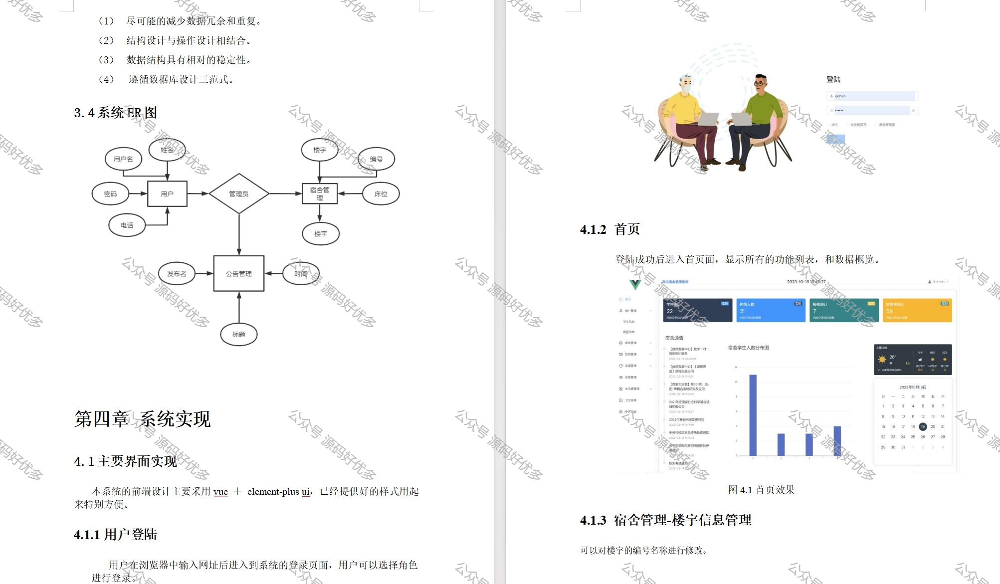

 
## 查看主页获取源码

### 一、作品包含

源码+数据库+设计文档万字+全套环境和工具资源+部署教程

### 二、项目技术

前端技术：Html、Css、Js Vue3

数据库：MySQL

后端技术：Java、Spring Boot、MyBatis

  

### 三、运行环境

开发工具：IDEA

数据库：MySQL8.0

数据库管理工具：Navicat10以上版本

环境配置软件： JDK1.8+Maven3.6.3

前端Nodejs：16

### 四、项目介绍
项目编号：springbootA201

学生宿舍管理系统对于一个学校来说是必不可少的组成部分，本系统具有运行速度快、安全性高、稳定性好的优点，并且具备完善的报表生成、修改功能，能够快速的查询学校所需的住宿信息
该拥有三种角色：系统管理员、宿舍管理员、学生
管理员：查看当前宿舍学生人数、住宿人数、报修数量、空舍数量
             查看学生信息、宿管信息、查看楼宇信息、查看公告信息、查看房间信息、查看报修信息、查看调寝信息、访客管理、卫生管理、水电管理、查看所有用户信息
学生： 查看当前宿舍学生人数、住宿人数、报修数量、空舍数量
           查看我的宿舍、申请调宿、申请报修、查看个人信息
宿舍管理员：查看当前宿舍学生人数、住宿人数、报修数量、空舍数量
	    查看学生信息、查看楼宇信息、查看公告信息、查看房间信息、查看报修信息、查看调寝信息、访客管理、卫生管理、水电管理、查看个人信息
### 五、运行截图

  
